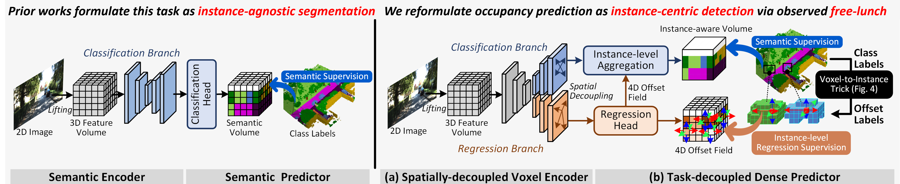
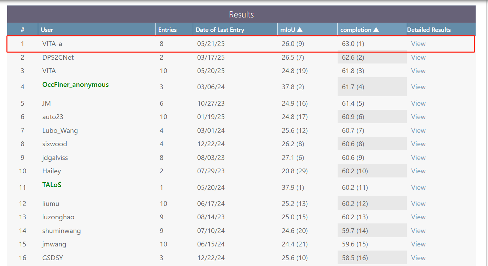
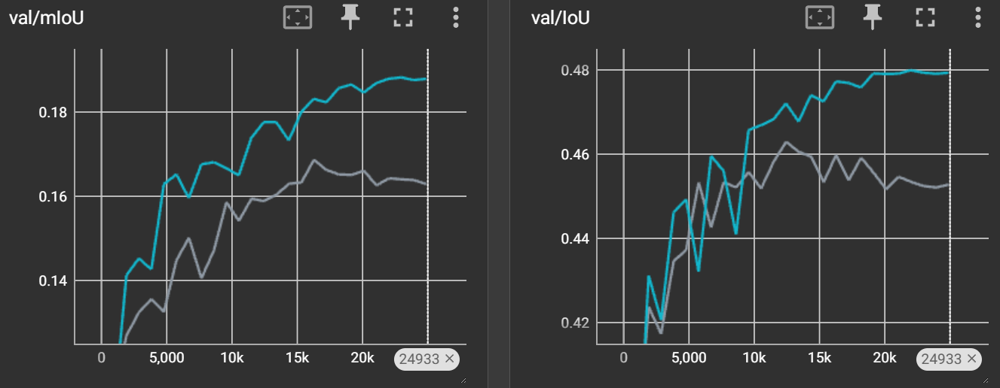
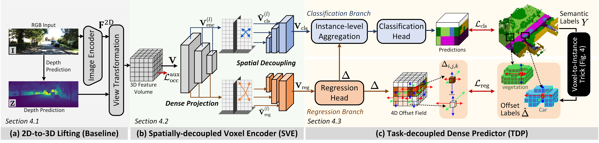

# [NeurIPS 25 Spotlight] VoxDet: Rethinking 3D Semantic Scene Completion as Dense Object Detection

### [[Project Page]](https://vita-epfl.github.io/VoxDet/)  [[ArXiv]](https://arxiv.org/abs/2506.04623) [[PPT]](./assets/Pre.pdf) 

📌 This is the official PyTorch implementation of the work:

> [**VoxDet: Rethinking 3D Semantic Occupancy Prediction as Dense Object Detection**](https://arxiv.org/abs/2506.04623) <br>
> [Wuyang Li <sup>1 </sup>](https://wymancv.github.io/wuyang.github.io/), [Zhu Yu <sup>2 </sup>](https://scholar.google.com/citations?user=oP4-z_QAAAAJ&hl=en), [Alexandre Alahi <sup>1 </sup>](https://scholar.google.com/citations?user=UIhXQ64AAAAJ&hl=en) <br><sup>1 </sup> École Polytechnique Fédérale de Lausanne (EPFL); <sup>2 </sup> Zhejiang University

<div align="center">
    
</div>

**📧 Contact**: [wuyang.li@epfl.ch](mailto:wuyang.li@epfl.ch)

## ✨ Highlight

*VoxDet* addresses semantic occupancy prediction with an instance-centric formulation inspired by dense object detection, which uses a *Voxel-to-Instance (VoxNT)* trick for freely transferring voxel-level class labels to instance-level offset labels.

- **Versatile**: Adaptable to various voxel-based scenarios, such as camera and LiDAR settings.
- **Powerful**: Achieves joint state-of-the-art performance on both camera-based and LiDAR-based SSC benchmarks.
- **Efficient**: Fast (~1.3× speed-up) and lightweight (~57.9% parameter reduction).
- **Leaderboard Topper**: Achieves 63.0 IoU (single-frame model), securing 1st place on the SemanticKITTI leaderboard.

Note that VoxDet is a single-frame single-model method without extra data and labels.

<div align="center">
    
</div>


## 🔧 Installation 


Please refer to [docs/dataset.md](docs/install.md) for detailed. This work is built on the CGFormer codebase. The installation, data preparation, training, and inference are consistent with CGFormer. If something is missing, you can check that codebase :)


## 📦 Dataset Preparation

Please refer to [docs/dataset.md](docs/dataset.md) for detailed dataset preparation instructions. Remember to change the data_root, ann_file and stereo_depth_root in every config file with your data path.


## 🏃 Train VoxDet

Download the depth pretraining model [onedrive](https://1drv.ms/u/c/350a4d1d810f5398/EbTX6xv2NylIq3CYhgJKxKwBh0aV0Q7XUe7pK9eTEptUcg?e=4JImgH), and then change `load_from` in all confige files accordingly. This pre-training is consistent with CGFormer using the config `configs/pretrain.py`.

Please refer to the reproduced log in the logs folder after code cleaning to ensure that every step is correct.

### Camera-based SemanticKITTI

2× A100 40G

```bash
CUDA_VISIBLE_DEVICES=0,1 python main.py \
--config_path configs/voxdet-semantickitti-cam.py \
--log_folder voxdet-semantickitti-cam \
--seed 42 \
--log_every_n_steps 100
```

or with 4 GPUs (24GB memory)

```bash
CUDA_VISIBLE_DEVICES=0,1,2,3 python main.py \
--config_path configs/4gpu-semantickitti-cam.py \
--log_folder voxdet-semantickitti-cam \
--seed 42 \
--log_every_n_steps 100
```

### LiDAR-based SemanticKITTI
```bash
CUDA_VISIBLE_DEVICES=0,1,2,3 python main.py \
--config_path configs/voxdet-semnatickitti-lidar.py \
--log_folder voxdet-semnatickitti-lidar \
--seed 42 \
--log_every_n_steps 100
```

### KITTI-360 Camera-based

2× A100 80G

```bash
CUDA_VISIBLE_DEVICES=0,1,2,3 python main.py \
--config_path configs/voxdet-kitt360-cam.py \
--log_folder voxdet-kitt360-cam \
--seed 42 \
--log_every_n_steps 100
```

## 📊 Evaluate VoxDet

Download the pretrained models and place them in the `ckpts/` folder, then run:

### Camera-based SemanticKITTI
```bash
python main.py \
--eval --ckpt_path ./ckpts/voxdet-semantickitti-cam.ckpt \
--config_path configs/voxdet-semantickitti-cam.py \
--log_folder voxdet-semantickitti-cam-eval \
--seed 42 \
--log_every_n_steps 100
```

### LiDAR-based SemanticKITTI
```bash
 python main.py \
--eval --ckpt_path ./ckpts/voxdet-semantickitti-lidar.ckpt \
--config_path configs/voxdet-semnatickitti-lidar.py \
--log_folder voxdet-semantickitti-lidar-eval \
--seed 42 \
--log_every_n_steps 100
```

### Save Predictions
Add `--save_path pred` to save prediction results:
```bash
python main.py \
--eval --ckpt_path ./ckpts/voxdet-semantickitti-cam.ckpt \
--config_path configs/voxdet-semantickitti-cam.py \
--log_folder voxdet-semantickitti-cam-eval \
--seed 42 \
--log_every_n_steps 100 \
--save_path pred
```

## 📋 Generate Predictions for SemanticKITTI Submission

For official SemanticKITTI leaderboard submission:

```bash
CUDA_VISIBLE_DEVICES=0,1,2,3 python main.py \
--eval --ckpt_path ./ckpts/voxdet-semantickitti-cam.ckpt \
--config_path configs/voxdet-semantickitti-cam-submit.py \
--log_folder voxdet-semantickitti-cam-submission \
--seed 42 \
--log_every_n_steps 100 \
--save_path submission \
--test_mapping
```

## 🎯 Model Zoo (Coming Soon)


Note that after using naive temporal fusion, VoxDet is able to achieve 20+ mIoU on SemanticKITTI test set (see logs folder).

We provide pretrained models for different configurations. We provide all reproduced information (models, configs, logs, everything) after the code cleaning [onedrive](https://1drv.ms/f/c/350a4d1d810f5398/EqJI_DVDJ9BLt8hvOC-mRxwBDGonkOBiPRsgL7oFmHvxWQ?e=wbP2Ti). I did not test them on test set. So the performance might be slightly higer/lower than the paper, but should be very similar according to the tensorboard log.

| Method | Dataset | Modality | IoU | mIoU | Config  |
|--------|---------|----------|------|------------|--------|----------|
| VoxDet | SemanticKITTI | Camera | 47.81 | 18.67 | [config](configs/voxdet-semantickitti-cam.py)   |
| VoxDet | SemanticKITTI | LiDAR | 63.0 | 26.0 | [config](configs/voxdet-semnatickitti-lidar.py)  |
| VoxDet | KITTI-360 | Camera | 48.59 | 21.40 | [config](configs/voxdet-kitt360-cam.py) |


## 🎨 Visualization

Please refer to [docs/visualization.md](docs/visualization.md).

## 📝 Available Configurations

VoxDet provides multiple configuration files for different scenarios:

- `configs/voxdet-semantickitti-cam.py`: Camera-based SemanticKITTI training
- `configs/voxdet-semnatickitti-lidar.py`: LiDAR-based SemanticKITTI training  
- `configs/voxdet-kitt360-cam.py`: Camera-based KITTI-360 training
- `configs/4gpu-semantickitti-cam.py`: 4-GPU optimized SemanticKITTI training
- `configs/baseline-dev-semantickitti-cam.py`: Improved baseline with engineering tricks
- `configs/pretrain.py`: first-stage depth pretraining. You need to use organize_ckpt.py to process checkpoint for model loading if you want to re-do this step by yourself. [onedrive](https://1drv.ms/u/c/350a4d1d810f5398/EbTX6xv2NylIq3CYhgJKxKwBh0aV0Q7XUe7pK9eTEptUcg?e=4JImgH) is out trained model, which is suggested to use directly.


## 📈 Training Logs

VoxDet (blue curve) is significantly more efficient and effective than the previous state-of-the-art method, CGFormer (gray color).

<div align="center">
    
</div>

## 📋 TODO List

- [x] Release the arXiv paper
- [x] Release the unified codebase, including both camera-based and LiDAR-based implementations
- [ ] Release all models

## 📚 Citation

<div align="center">
    
</div>

If you find our work helpful for your research, please consider citing our paper:

```bibtex
@inproceedings{li2025voxdet,
  title={VoxDet: Rethinking 3D Semantic Occupancy Prediction as Dense Object Detection},
  author={Li, Wuyang and Yu, Zhu and Alahi, Alexandre},
  journal={NeurIPS},
  year={2025}
}
```


## 🙏 Acknowledgement

Greatly appreciate the tremendous effort for the following projects!

- [FCOS: Fully Convolutional One-Stage Object Detection](https://arxiv.org/abs/1904.01355)
- [Context and Geometry Aware Voxel Transformer for Semantic Scene Completion](https://arxiv.org/abs/2405.13675)
- [SIGMA: Semantic-complete Graph Matching For Domain Adaptive Object Detection](https://arxiv.org/abs/2203.06398)
- [Revisiting the Sibling Head in Object Detector](https://arxiv.org/abs/2003.07540)
- [VoxFormer: a Cutting-edge Baseline for 3D Semantic Occupancy Prediction](https://arxiv.org/abs/2302.12251)
