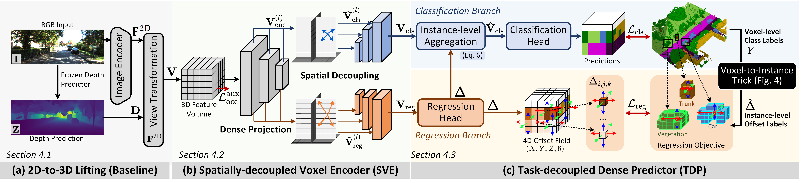

# [ArXiv 25] VoxDet: Rethinking 3D Semantic Occupancy Prediction as Dense Object Detection

### [[Project Page]](https://vita-epfl.github.io/VoxDet/)  [[ArXiv]](https://arxiv.org/abs/2506.04623) [[PPT]](./assets/Pre.pdf) 

📌 This is the official PyTorch implementation of the work:

> [**VoxDet: Rethinking 3D Semantic Occupancy Prediction as Dense Object Detection**](https://arxiv.org/abs/2506.04623) <br>
> [Wuyang Li <sup>1 </sup>](https://wymancv.github.io/wuyang.github.io/), [Zhu Yu <sup>2 </sup>](), [Alexandre Alahi <sup>1 </sup>](https://scholar.google.com/citations?user=UIhXQ64AAAAJ&hl=en) <br><sup>1 </sup> École Polytechnique Fédérale de Lausanne (EPFL); <sup>2 </sup> Zhejiang University

<div align="center">
    
</div>


**We will officially open-source our code after the paper review. But considering the approaching CVPR/ICLR deadlines (and I am also a kind person), anyone who really likes our work and hopes to follow our work can email me to get the developing version (has not been fully code-cleaned), which is also used for our developing VoxDet++. It was ready last month and has been sent to some followers. Thank you for being so understanding!**

Contact: [wuyang.li@epfl.ch](mailto:wuyang.li@epfl.ch)

## ✨ Highlight

*VoxDet* addresses semantic occupancy prediction with an instance-centric formulation inspried by dense object detection, which uses a *Voxel-to-Instance (VoxNT)* trick freely transferring voxel-level class labels to instance-level offset labels.

- **Versatile**: Adaptable to various voxel-based scenarios, such as camera and LiDAR settings.
- **Powerful**: Achieve joint state-of-the-art on both camera-based and LiDAR-based SSC benchmarks.
- **Efficient**: Fast (~1.3× speed-up) and lightweight (reducing ~57.9% parameters).
- **Leaderboard Topper**: Achieve 63.0 IoU (single-frame model), securing 1st place on the SemanticKITTI leaderboard.

Note that VoxDet is a single-frame single-model method without extra data and labels.

<div align="center">
    
</div>


## 📈 Training logs

VoxDet (blue curve) is significantly more efficient and effective than the previous state-of-the-art method, CGFormer (gray color).


<div align="center">
    
</div>


## 🙏 Acknowledgement

Greatly appreciate the tremendous effort for the following projects!

- [FCOS: Fully Convolutional One-Stage Object Detection](https://arxiv.org/abs/1904.01355)
- [Context and Geometry Aware Voxel Transformer for Semantic Scene Completion](https://arxiv.org/abs/2405.13675)
- [SIGMA: Semantic-complete Graph Matching For Domain Adaptive Object Detection](https://arxiv.org/abs/2203.06398)
- [Revisiting the Sibling Head in Object Detector](https://arxiv.org/abs/2003.07540)
- [VoxFormer: a Cutting-edge Baseline for 3D Semantic Occupancy Prediction](https://arxiv.org/abs/2302.12251)

## 📋 TODO List

- [x] Release the arXiv paper
- [ ] Release the unified codebase, including both camera-based and LiDAR-based implementations
- [ ] Release all models

## 📚Citeation

<div align="center">
    
</div>

If you think our work is helpful for your project, I would greatly appreciate it if you could consider citing our work.

```bibtex
@article{li2025voxdet,
  title={VoxDet: Rethinking 3D Semantic Occupancy Prediction as Dense Object Detection},
  author={Li, Wuyang and Yu, Zhu and Alahi, Alexandre},
  journal={arXiv preprint arXiv:2506.04623},
  year={2025}
}
```
